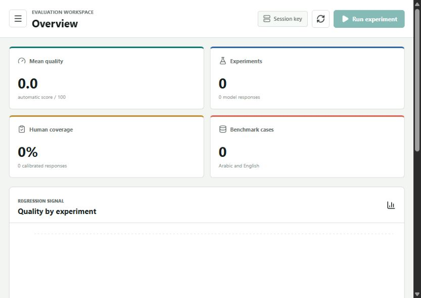

# LLM Evaluation Lab

<p>
  <a href="https://llm-evaluation-lab.onrender.com"></a>
  
  
  
</p>

<a href="https://llm-evaluation-lab.onrender.com">
  
</a>

**[Open the live evaluation workspace →](https://llm-evaluation-lab.onrender.com)**

A bilingual AI quality workspace for running repeatable LLM benchmarks, comparing models, reviewing failure modes, and calibrating automatic scores with human judgment.

Created by Ahmed Elsaid as a portfolio proof for AI Quality, LLM Evaluation, and applied AI engineering roles.

## What it proves

- Evaluation dataset and rubric design
- Arabic and English response-quality analysis
- Multi-model experiment orchestration
- Instruction-following, accuracy, relevance, language, and safety scoring
- Human-in-the-loop review and evaluator calibration
- Failure taxonomy, latency, cost, and regression reporting
- Secure live model access without storing the user's API key

## My role and AI assistance

I defined the product problem, benchmark workflow, data model, scoring dimensions, human-review loop, acceptance criteria, and deployment requirements. I used AI coding assistants heavily to generate and refine the implementation, then reviewed the structure, tested behavior, debugged failures, and iterated on the product.

This repository is evidence of **AI-assisted product and engineering execution**. It is not presented as code written entirely from memory or without assistance.

## Try it in three steps

1. Create a small Arabic or English dataset with expected behavior.
2. Choose simulation mode, or enter an OpenRouter key and select candidate models.
3. Run the benchmark, inspect scores and failure modes, then add human reviews.

## Modes

### Simulation

Runs locally with synthetic model responses and deterministic evaluation. Simulation results are labeled clearly in the interface and do not call an AI API.

### Live OpenRouter

Runs the benchmark against any one to four models in OpenRouter's current catalogue. The model picker supports search, provider filtering, exact `provider/model` IDs, context-window details, modalities, and current token pricing, so an evaluator can compare a newest model, a production model, a lower-cost baseline, or any other custom combination.

The key can be entered for one run or configured in `backend/.env`. A judge model evaluates each response; deterministic checks remain available as a fallback. Models that are not available through OpenRouter require a separate provider integration.

Judge selection includes five practical presets:

- **Economical:** GPT-4o mini for low-cost development runs
- **Reasoning:** o3-mini for more deliberate correctness grading
- **Strong:** GPT-5 for final general-purpose benchmarks
- **Independent:** Claude Opus 4.1 for cross-provider judging
- **Bilingual:** Gemini 2.5 Pro for Arabic-English calibration

Any model in the live catalogue can also be selected as a custom judge. The interface warns when a judge is also a candidate model or shares a provider with one. Automated judge scores should be calibrated against human reviews before they are treated as decision-grade measurements.

## User-owned benchmark data

The workspace starts blank. Create a dataset in the **Datasets** view, then add real evaluation cases with:

- prompt and expected behavior
- language and category
- rubric dimensions
- optional required and forbidden signals

No employer, customer, accounting, or confidential operational data is bundled with the project. Simulation remains available for quick calibration checks; live runs use the models selected through OpenRouter.

## Architecture

```text
React + TypeScript dashboard
          |
          v
FastAPI experiment API ---- OpenRouter (live mode only)
          |
          v
SQLite datasets, runs, responses, automatic scores, human reviews
```

## Local setup

Requirements: Node.js 20+ and Python 3.11+.

```powershell
pnpm install
python -m venv backend/.venv
backend/.venv/Scripts/python.exe -m pip install -r backend/requirements.txt
```

Start the API:

```powershell
backend/.venv/Scripts/python.exe -m uvicorn app.main:app --app-dir backend --host 127.0.0.1 --port 8011
```

Start the dashboard in another terminal:

```powershell
pnpm dev
```

Open `http://127.0.0.1:4181`.

For a persistent OpenRouter key, copy `backend/.env.example` to `backend/.env` and set `OPENROUTER_API_KEY`. The `.env` file is ignored by Git.

## Deployment

The root `Dockerfile` builds the React frontend and serves it from the FastAPI service. The included `render.yaml` can deploy the complete demo as one Render web service.

The default hosted database path is ephemeral and is intended only for a portfolio demo. Use persistent storage or migrate SQLite to Postgres before relying on hosted experiment history.

## Current limitations

- Hosted experiment history is ephemeral on the current Render deployment.
- Automatic judge scores are signals, not ground truth; they require human calibration.
- OpenRouter model availability and pricing can change independently of this project.
- This is a portfolio laboratory, not a production evaluation platform with authentication, teams, or persistent cloud storage.

## Verification

```powershell
backend/.venv/Scripts/python.exe -m pytest backend/tests -q
pnpm lint
pnpm build
```

## API surface

- `GET /api/overview`
- `GET /api/datasets`
- `POST /api/datasets`
- `POST /api/datasets/{id}/cases`
- `GET /api/experiments`
- `POST /api/experiments`
- `GET /api/experiments/{id}`
- `GET /api/review-queue`
- `POST /api/responses/{id}/human-review`
- `GET /api/experiments/{id}/export.csv`
